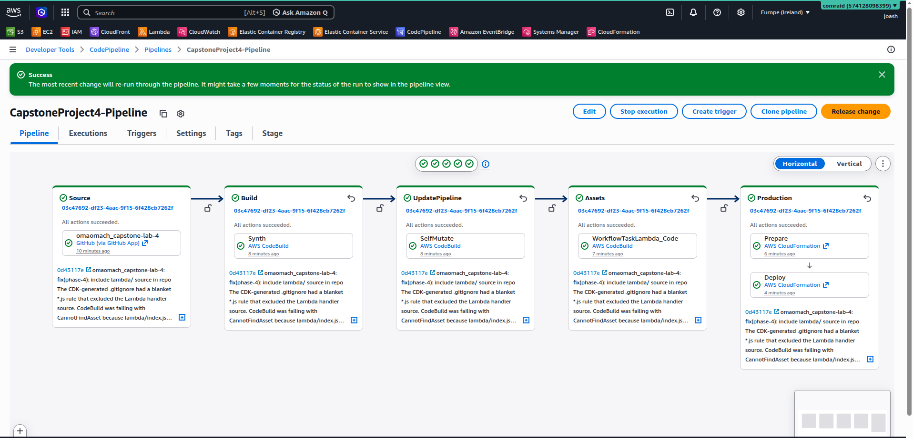
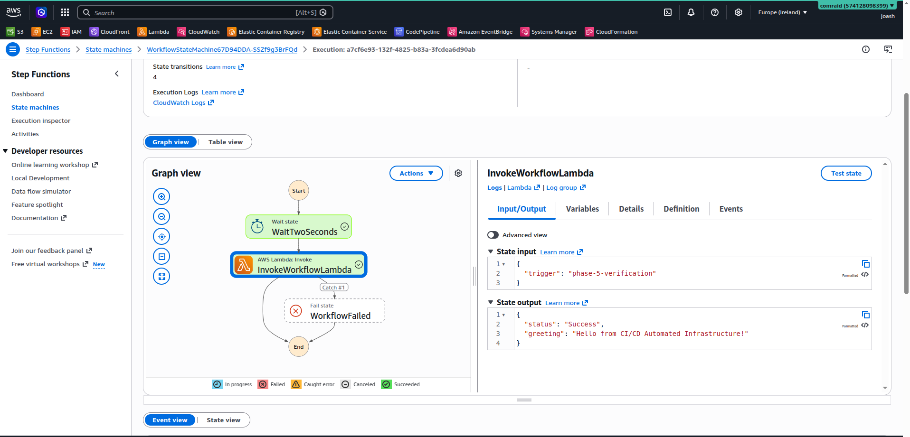
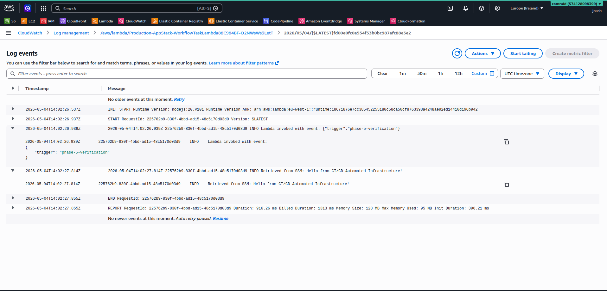

# Capstone Project 4: Multi-Account, Automated, and Governed Cloud Platform

A self-mutating CI/CD pipeline built with AWS CDK (TypeScript) that deploys a serverless workflow on every push to `main`. The deployed workflow demonstrates dynamic configuration management via SSM Parameter Store, orchestrated by AWS Step Functions invoking AWS Lambda.

**Live AWS account:** `574128098399` &nbsp;·&nbsp; **Region:** `eu-west-1` (Ireland)

---

## Architecture

```

   GitHub                  AWS CodePipeline                  CloudFormation
   (omaomach/             ┌──────────────────┐              ┌──────────────────┐
   capstone-lab-4)        │ Source           │              │ Production-      │
        │                 │   ↓              │              │   AppStack       │
        │  push to main   │ Build (Synth)    │              │                  │
        └────────────────▶│   ↓              │─────────────▶│  ┌────────────┐  │
                          │ UpdatePipeline   │              │  │ SSM Param  │  │
                          │   ↓              │              │  └─────┬──────┘  │
                          │ Assets           │              │        │ reads   │
                          │   ↓              │              │  ┌─────▼──────┐  │
                          │ Production       │              │  │  Lambda    │  │
                          │   (Deploy)       │              │  └─────▲──────┘  │
                          └──────────────────┘              │        │ invokes │
                                                            │  ┌─────┴──────┐  │
                                                            │  │  Step      │  │
                                                            │  │  Functions │  │
                                                            │  └────────────┘  │
                                                            └──────────────────┘
```

### Components

- **Infrastructure as Code:** AWS CDK v2 in TypeScript. Three stacks (`PipelineStack`, `Production-AppStack`, plus `CDKToolkit` from bootstrap), wrapped using a CDK `Stage` for pipeline-driven deployment.
- **CI/CD Automation:** AWS CodePipeline (V1 type for reliable webhook triggers), CodeBuild for synth and asset publishing. Pipeline is self-mutating — defined in CDK, redeploys itself when `pipeline-stack.ts` changes.
- **Source Integration:** AWS CodeStar Connections (modern OAuth-based GitHub trust, replacing deprecated PAT/webhook approach).
- **Workflow Orchestration:** AWS Step Functions Standard workflow with two states (`Wait` → `Task`), plus retry policy (3 attempts, exponential backoff) and a catch state routing failures to a dedicated `Fail` state.
- **Compute & Configuration:** AWS Lambda (Node.js 20.x) using AWS SDK v3 (`@aws-sdk/client-ssm`) to read configuration from SSM Parameter Store at runtime. Least-privilege IAM via CDK's `grantRead()`.

---

## Repository structure

```
capstone-lab-4/
├── bin/
│   └── capstone-project-4.ts      # CDK app entry point — instantiates PipelineStack
├── lib/
│   ├── app-stack.ts               # AppStack: SSM parameter, Lambda, Step Functions
│   ├── app-stage.ts               # AppStage: deployable stage wrapping AppStack
│   └── pipeline-stack.ts          # PipelineStack: CodePipeline definition
├── lambda/
│   └── index.js                   # Lambda handler — reads SSM, returns greeting
├── docs/
│   └── screenshots/               # Phase-by-phase deployment evidence
├── cdk.json                       # CDK CLI configuration
├── package.json                   # Node dependencies
└── tsconfig.json                  # TypeScript compiler config
```

---

## How it works

### 1. SSM Parameter — dynamic config

A `String` parameter at `/app/config/greeting` defined in `lib/app-stack.ts`. Its value can be updated in the AWS console without touching code or redeploying — the Lambda reads the latest value on every invocation. This decouples configuration from compute.

### 2. Lambda function

`lambda/index.js` retrieves the SSM parameter using AWS SDK v3 (the v2 SDK shown in the lab appendix has been removed from Node.js 18+ runtimes). The handler:

1. Logs the invocation event.
2. Calls `ssm:GetParameter` against `/app/config/greeting`.
3. Logs the retrieved value to CloudWatch.
4. Returns `{ status, greeting }` to the caller (Step Functions in our case).

### 3. IAM — least privilege

The Lambda's IAM policy is generated automatically by `configParam.grantRead(workflowLambda)` in CDK. The resulting policy permits exactly four SSM actions (`Describe`, `Get`, `GetHistory`, `GetParameters`) scoped to **only** the parameter's ARN — not all of SSM. This satisfies the rubric's "correct IAM permissions" requirement.

### 4. Step Functions state machine

Two states chained together:

- `WaitTwoSeconds` (`Wait` state) — pauses for 2s. Demonstrates the Wait state type and gives the visual graph a clear first node.
- `InvokeWorkflowLambda` (`Task` state) — invokes the Lambda. Decorated with:
  - **Retry policy:** 3 attempts with exponential backoff (2s, 4s, 8s), filtering on transient AWS error codes only.
  - **Catch handler:** routes any unhandled error to a `Fail` state with a descriptive cause/error pair.

State machine logs every transition to a dedicated CloudWatch log group with 2-week retention.

### 5. CI/CD pipeline

`PipelineStack` defines a CodePipeline with five stages:

| Stage                       | What it does                                                                      |
| --------------------------- | --------------------------------------------------------------------------------- |
| Source                      | Pulls latest commit from `omaomach/capstone-lab-4` `main` via CodeStar Connection |
| Build (Synth)               | Runs `npm ci` + `npx cdk synth` in CodeBuild                                      |
| UpdatePipeline (SelfMutate) | Redeploys the pipeline if `pipeline-stack.ts` changed                             |
| Assets                      | Publishes Lambda zip to the CDK assets S3 bucket                                  |
| Production                  | Deploys `Production-AppStack` via CloudFormation (Prepare + Deploy)               |

The pipeline is **self-mutating** (`selfMutation: true`). After the initial manual `cdk deploy`, all subsequent changes — including changes to the pipeline itself — flow exclusively through `git push`.

---

## Deployment evidence

The three rubric-required screenshots live in `docs/screenshots/`. Additional evidence captures the full deployment narrative end-to-end.

### Successful CodePipeline execution

All five stages green, deploying both the pipeline self-update and the application stack from a single push to `main`.



### Step Functions execution graph

A successful execution showing the Wait state followed by the Lambda invocation. The right panel shows the input (`{"trigger": "phase-5-verification"}`) and the SSM-retrieved greeting in the output.



### CloudWatch Logs — Lambda retrieving SSM value

The Lambda's CloudWatch log stream showing the `Retrieved from SSM:` line, proving the runtime config retrieval works through the pipeline-deployed Lambda.



---

## Reproducing the setup

### Prerequisites

- Node.js 20+ (we used 22.13.0)
- AWS CLI configured with credentials pointing to the target account
- AWS CDK CLI: `npm install -g aws-cdk`
- A GitHub account with the repo forked or cloned

### One-time setup

**1. Bootstrap the AWS environment** (creates the CDK assets bucket and IAM roles):

```bash
cdk bootstrap aws://<ACCOUNT_ID>/eu-west-1
```

**2. Create a CodeStar Connection to GitHub:**

In the AWS Console: CodePipeline → Settings → Connections → Create connection → GitHub. Authorize the AWS Connector for GitHub app on the target repo. Copy the resulting connection ARN.

**3. Update the connection ARN** in `lib/pipeline-stack.ts`:

```typescript
const githubConnectionArn = "arn:aws:codeconnections:..."; // ← your ARN
```

Also update the `account` and `region` values throughout to match your environment.

**4. Initial pipeline deploy** (the only manual deploy ever needed):

```bash
npm ci
npx cdk deploy
```

After this, the pipeline takes over. Push to `main` and watch CodePipeline auto-deploy.

---

## Verifying the auto-deploy loop

To prove the pipeline picks up arbitrary changes:

1. Edit the SSM parameter's `stringValue` in `lib/app-stack.ts`.
2. Commit and push to `main`.
3. Watch the pipeline auto-trigger and redeploy `Production-AppStack`.
4. Start a new Step Functions execution — its output now reflects the new value.

This was demonstrated during deployment by changing the greeting from _"Hello from CI/CD Automated Infrastructure!"_ to _"Hello from a pipeline-managed SSM parameter — deployed automatically on push."_ — visible in the latest Step Functions execution outputs.

---

## Technical decisions and gotchas

A few real issues encountered during deployment and how they were resolved — documented for transparency:

**1. CDK-generated `.gitignore` excluded Lambda source.** The default `*.js` rule in the auto-generated `.gitignore` matched `lambda/index.js`, so the Lambda source never reached GitHub. CodeBuild then failed with `«CannotFindAsset» Cannot find asset at .../src/lambda`. Fixed by adding `!lambda/**/*.js` as a negation pattern. Local `cdk deploy` worked because the file existed locally; CodeBuild only sees what's in git.

**2. Node.js runtime updated from 18 to 20.** The lab appendix specified `NODEJS_18_X`, but Node 18 reached end-of-support in AWS Lambda in early 2026 — new functions can no longer be created on it. Switched to `NODEJS_20_X`, the current AWS-recommended LTS.

**3. AWS SDK v2 → v3.** The lab's appendix used `require('aws-sdk')` (SDK v2), which has been removed from the Node.js 18+ Lambda runtime. Replaced with the modular SDK v3 equivalent (`@aws-sdk/client-ssm`), which is pre-installed in the runtime and produces faster cold starts.

**4. CodePipeline V1 instead of V2.** Initially used CodePipeline V2 (the default in CDK Pipelines), which uses polling-based `DetectChanges`. Push events were not consistently triggering pipeline runs. Switched to V1, which registers a classic webhook with GitHub via the CodeStar Connection — fires reliably within seconds of every push. V2 has more advanced features (manual approvals, parallel actions) but they're unnecessary for this single-environment pipeline.

**5. Initial pipeline deploy with stale GitHub state.** First `cdk deploy` of the pipeline ran while GitHub still had the pre-restructure code (Phase 3 layout), causing the first auto-triggered build to fail at synth. The pipeline's behavior here is actually a feature: it refused to deploy bad code and stopped at Build, leaving the existing infrastructure intact. After pushing the corrected source, the next pipeline run succeeded end-to-end.

---

## Cleanup

To tear down all created resources (saves ongoing AWS charges):

```bash
# Destroy the application stack first (created by the pipeline)
aws cloudformation delete-stack --stack-name Production-AppStack --region eu-west-1

# Then destroy the pipeline stack
npx cdk destroy

# Optionally, also remove the bootstrap stack:
aws cloudformation delete-stack --stack-name CDKToolkit --region eu-west-1
```

The CodeStar Connection can be deleted from the AWS Console (CodePipeline → Settings → Connections).

---

## Submission

GitHub repository: <https://github.com/omaomach/capstone-lab-4>

Submitted by: **Omao Machoka** (Moringa AWS Cloud Engineering, Capstone 4)
